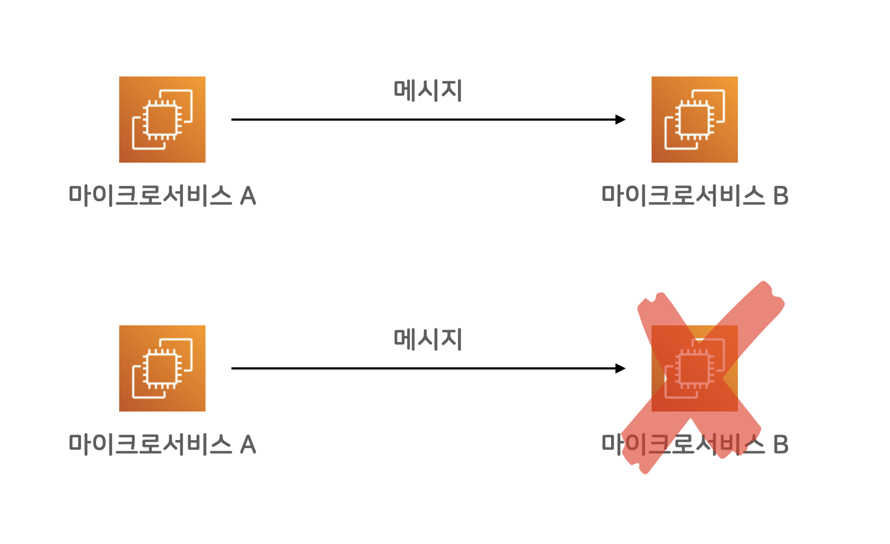

# 마이크로 서비스에 Amazon SQS 메시지 큐 활용하기

## Amazon SQS란?

> Amazon Simple Queue Service(SQS)는 마이크로 서비스, 분산 시스템 및 서버리스 애플리케이션을 쉽게 분리하고 확장할 수 있도록 지원하는 완전관리형 메시지 대기열 서비스입니다. SQS는 메시지 중심 미들웨어를 관리하고 운영하는 데 따른 복잡성과 오버헤드를 없애고 개발자가 차별화 작업에 집중할 수 있도록 지원합니다. SQS를 사용하면 메시지 손실 위험을 감수하거나 다른 서비스를 가동할 필요 없이 소프트웨어 구성 요소 간에 모든 볼륨의 메시지를 전송, 저장 및 수신할 수 있습니다. AWS 관리 콘솔, 명령줄 인터페이스 또는 원하는 SDK, 3가지 간단한 명령을 사용하여 몇 분 만에 SQS를 시작할 수 있습니다.

공식 홈(<https://aws.amazon.com/ko/sqs>)에 있는 설명입니다. 말이 조금 어렵게 느껴지지만, 정확하게 적혀 있습니다. 이하, 친절한 설명 덧붙여보겠습니다.

## 메시지 큐 -- MQ

Amazon SQS는 AWS에서 운영해주는 메시지 큐 서비스입니다. 메시지 큐 서비스(또는 메시지 브로커)는, 소프트웨어 시스템 사이에 메시지를 주고받을 수 있는 믿을만한 우체국 시스템이라고 볼 수 있습니다.

핸드폰 통화 연결과, 카카오톡 메시지 연결의 차이로 비유해봐도 될 것 같습니다. 핸드폰 통화 연결은, 즉각적인 대화를 할 수 있습니다만, 당연히도, 통화 당사자 두 명이 둘 다 깨어있고 대화에 집중해야 합니다. (대화에 집중 안 하는 상대도 많다는 점은 논외로 합시다) 한 명이라도 잠든 상태라면 통화 연결이 되지 않을 테고, 대화 진행이 되지 않겠죠.

카카오톡 메시지의 경우에는, 한 명이 운전 중이거나 하는 이유로 잠시 연결이 되지 않더라도, 메시지를 보낸 사람이 메시지를 보내고 다른 일을 하고 있을 수 있고, 받은 사람은 운전을 다 하고 나서, 메시지를 확인한 다음 응답할 수 있습니다.

마이크로 서비스 사이에 메시지 전달을 이어주는 카카오톡이 메시지 큐라고 보면 이해하기 쉬울 것 같습니다. 메시지 큐는 일반적으로 장애에 대한 내성이 (대단히) 높고, 메시지를 안전하게 저장해서 유실되지 않게 보장해 주곤 합니다. 일단 성공적으로 메시지를 큐에 넣었다면, (거의) 반드시 수신자에게 전달된다고 믿을 수 있습니다.

## 마이크로 서비스끼리 직접 통신



백엔드 마이크로 서비스 A와 B가 통신을 해야 하는 상황에, 보통의 네트워크 통신을 한다면, 즉각적으로 결과를 확인해가며 동기식(synchronous)으로 통신할 수 있습니다만, 대신 A나 B 둘 중 하나만 문제 상황을 만나더라도 전체 시스템이 실패하는 문제가 있습니다.

위 그림에서 보자면, 서비스 B에 장애가 발생하면, 해당 메시지를 주고받아야 했던 상황 전체가, 시스템 차원에서 실패한 꼴이 됩니다. 서비스 A는 문제없이 정상이었는데도 말이죠. A 입장에서는 억울한 상황입니다.

## 메시지 큐를 활용한 간접 통신


마이크로 서비스 사이 중간에 메시지 큐 서비스를 활용해 통신하면, 메시지 송수신 채널을 유연하게 연결할 수 있습니다. 중간에 메시지 브로커가 **안전하고 유연한 버퍼** 역할을 해주어서, 메시지를 발송하는 쪽에서는 메시지 수신부가 정상적인지 아닌지 큰 걱정 없이 메시지를 보내고 다른 일을 할 수 있습니다.

마이크로 서비스 B에서 일시적인 문제가 발생했다고 하더라도, 마이크로 서비스 A에서는 정상적으로 메시지를 브로커에 보낼 수 있고, B입장에서는, 다시 정상 작동하는 시점에 메시지를 가져올 수 있습니다. 잠깐의 장애 상황에 대해서 대응할 수 있는 여력이 생긴 거죠.

참고로, 메시지 브로커 서비스는, 다중화 구성을 기본으로 장애 걱정 없이 믿을 만한 시스템으로 구축합니다. 브로커 시스템 일부에 장애가 발생하더라도, 브로커 시스템 전체로 보자면 정상 작동하도록 믿을 수 있는 높은 신뢰도를 바탕으로 운영됩니다. 각자 갖고 있는 스마트폰이 물에 빠지거나 문제가 생길지언정, 카카오톡 서버가 메시지를 유실했다고 생각하기 쉽지 않은 것처럼요.

메시지를 보내는 쪽을 프로듀서(producer)라고 부르고, 받아서 사용하는 쪽을 컨슈머(consumer)라고 부릅니다.

## Amazon SQS


메시지 큐 시스템을 자체 인프라에 운영하던 시절에는 오픈 소스 프로젝트로 [RabbitMQ](https://www.rabbitmq.com)가 널리 활용됐었는데요, 클라우드 환경으로 넘어가고, 게다가 AWS에서 책임지고 운영해주는 SQS 같은 브로커 시스템이 등장하면서, 훨씬 더 편리해진 것 같습니다. AWS에서 책임지고 믿을만하게 운영해주기 때문에, 우리는 브로커 운영 부담은 전혀 없이, 각자 개발하는 시스템에서 메시지만 보내고 받아도 되게 된 거죠.


SQS 시스템은 확장성이 매우 뛰어난 브로커 역할을 합니다. 예를 들어, 고객의 요청을 받은 ELB 로드밸런서가, 웹 서비스들로 부하를 분산시켜주고, 각각의 웹 서비스 인스턴스들이 각자 맘 편히 SQS 큐에 메시지를 쌓고, 뒷 단에서 메시지를 처리하는 마이크로 서비스가 묵묵히 자기 일을 하는 식으로 시스템을 구성 할 수 있습니다. DB값을 바꾸는 일처럼, 당장 즉각적인 처리를 반드시 해야 하는 일만 앞단에서 처리하고, 이어서 관련한 시간이 오래 걸리는 일들을 분리해서, 큐 뒷단에서 처리할 수 있겠습니다.

## Amazon SQS의 상세 특징

SQS가 메시지 브로커 시스템을 본격 활용하기에 앞서, 구체적인 특징들을 미리 살펴보겠습니다.

### 기본 특징

* 각 메시지는 최대 256KB 크기입니다. S3에 메시지 본문을 담는 방식을 추가로 지원하기 때문에, 제한 없이 쓸 수도 있습니다.
* 큐에 저장되는 메시지 건 수의 제한은 없습니다.
* 다만 각각의 메시지는 최대 14일간 유지됩니다. 14일 이내에 메시지를 처리(consume) 해야 합니다.

### 두 가지 큐 종류 -- 표준대기열 vs. FIFO 대기열

보통의 메시지 큐 시스템은, 기본적으로 최소 한번 전송(at least once delivery)을 약속합니다. 혹시 문제가 생기더라도, 최소한 한 번 이상 메시지를 전송해준다는 약속인데요, 그 말은, 같은 메시지가 두 번 이상 수신될 수도 있다는 뜻입니다. 여러 번 수신될 수도 있긴 해도, 어쨌건 유실되지는 않는다는 약속을 지킵니다. 표준대기열은, 이 "최소 한번 전송" 약속을 해주는 큐 시스템이고, FIFO 대기열을 선택하면, 정확히 한번(exactly once) 전송을 약속해 줍니다. 최소 한번 전송 방식에서, 중복 여부를 브로커가 확인해줘서 두 번째 중복 메시지부터는 버려주는 시스템인 셈입니다.

* At least once -- 최소 한 번 이상 메시지 전송을 약속
* Exactly once -- 정확히 딱 한 번 메시지 전송되는 것을 약속 (중복 메시지 제거해줌)

언뜻 보면, 고민할 필요 없이 FIFO 대기열이 좋은 것 같습니다만, 세상에 공짜는 없겠죠? FIFO 대기열 시스템은, 표준 대기열 시스템에 비해서 확장성이 떨어지고, 비용이 약간 비쌉니다. 둘 다 아주 저렴한 수준이어서 비용은 문제가 되지 않을 것 같습니다만, 확장성에 문제가 드러날 수도 있겠습니다.

표준 대기열 시스템은, 사실상 무한대의 처리량을 지원하고, FIFO 시스템은 초당 최대 300건의 메시지 API를 처리할 수 있습니다. 한 번의 API에 최대 10개 메시지를 한 번에 배치 처리할 수 있기 때문에, 매초 최대 3천 건 메시지를 처리할 수 있는 제한이 있는 셈입니다. 꽤 높은 처리량이기 때문에, 대부분의 소규모 시스템에서는 충분하겠습니다만, 규모가 커진다면, 이 제한이 문제가 될 수도 있겠습니다. 그리고, FIFO 시스템은, 메시지 전달 순서도 보장됩니다. 먼저 보낸 메시지가 먼저 수신됩니다. 물론, 수신부(consumer)가 하나여야 의미 있는 얘기가 되겠지만 말이죠.

기능         표준대기열                  FIFO 대기열
-----------  ----------                  ----------------
메시지 보장  최소 한번 (중복 수신 가능)  정확히 한번
처리량       사실상 무제한               최대 3,000메시지/초
비용         약 $0.4/백만건              약 $0.5/백만건
순서보장     순서가 바뀔 수 있다         먼저 송신한 메시지가 먼저 수신된다


### 메시지 생명주기 -- lifecycle

1. 메시지 송신부(producer)가 SQS에 메시지 A를 보냅니다.
1. SQS는 메시지A를 사본을 만들어 여러 곳에 안전하게 보관합니다. (유실 방지)
1. 수신부(consumer)가 SQS에서 메시지 A를 처리하고자 가져갑니다. (inflight 상태)
1. SQS입장에서 수신부가 메시지A를 가져갔기 때문에, 큐에 메시지가 남아있기는 하지만, 다른 컨슈머가 메시지 A를 (또) 가져가지 않도록 일정시간동안(visibility timeout) 수신요청에 드러나지 않습니다.
1. 수신부(consumer)가 메시지를 정상 처리 완료했다면, 직접 SQS에 메시지A를 삭제하도록 요청합니다. (완료)
1. 만약 어떤 이유로 수신부(consumer)가 메시지를 삭제하지 않는다면, 일정 시간이 지나면, 메시지 A가 다시 수신 요청에 드러납니다. (재처리 가능)

* visibility timeout -- 기본 30초. 0초에서 12시간 사이 설정 가능. 기본은 큐에 설정. 메시지 개별 설정도 가능.


## SQS Java 예제

AWS SDK 예제 깃헙에, SQS 관련 예제도 잘 나와있습니다. 그중 일부 예제를 가져와 정리했습니다.

<https://github.com/awsdocs/aws-doc-sdk-examples/tree/main/javav2/example_code/sqs>

### Gradle 의존성 설정

```build.gradle
dependencies {
  // ...다른 의존성 설정...
	implementation platform('software.amazon.awssdk:bom:2.15.0')
	implementation 'software.amazon.awssdk:sqs'
}
```

AWS Java SDK 중, SQS 의존성을 추가합니다.

### 기본 import

```java
import software.amazon.awssdk.auth.credentials.ProfileCredentialsProvider;
import software.amazon.awssdk.regions.Region;
import software.amazon.awssdk.services.sqs.SqsClient;
import software.amazon.awssdk.services.sqs.model.*;
```

### SQS 클라이언트 준비

```java
SqsClient buildClient() {
  return SqsClient.builder()
    .region(Region.AP_NORTHEAST_2)
    .credentialsProvider(ProfileCredentialsProvider.create())
    .build();
}
```

사용하고자 하는 리전을 지정하고, 적절한 자격증명 설정 방식을 선택합니다.

### 큐 URL 얻기

```java
String getQueueUrl(SqsClient sqsClient, String queueName) {
  try {
    GetQueueUrlResponse getQueueUrlResponse =
      sqsClient.getQueueUrl(GetQueueUrlRequest.builder().queueName(queueName).build());
    String queueUrl = getQueueUrlResponse.queueUrl();
    return queueUrl;
  } catch (SqsException e) {
    System.err.println(e.awsErrorDetails().errorMessage());
    System.exit(1);
  }
  return "";
}
```

AWS 콘솔이나, 별도 작업으로 만들어 둔 SQS 큐 이름을 기준으로, 큐 접근 URL을 구합니다.

### 큐에 메시지 보내기

```java
void sendMessage(SqsClient sqsClient, String queueUrl, String message) {
  sqsClient.sendMessage(SendMessageRequest.builder()
    .queueUrl(queueUrl)
    .messageBody(message)
    .build());
}
```

메시지 송신 요청 객체를 만들어서, 큐 URL에 전송하는 코드입니다.

### 메시지 송신 -- produce

```java
void produce() {
  SqsClient sqsClient = buildClient();
  String queueUrl = getQueueUrl(sqsClient, "testQueue");
  sendMessage(sqsClient, queueUrl, "Hello World!");
  sqsClient.close();
}
```

기본 흐름은, SQS클라이언트를 생성하고, 큐 URL을 구한 뒤, 메시지를 보내고, 클라이언트를 닫으면 됩니다.

### 메시지 수신 -- consume


```java
void consume(SqsClient sqsClient, String queueUrl) {
  ReceiveMessageRequest receiveRequest = ReceiveMessageRequest.builder()
      .queueUrl(queueUrl)
      .waitTimeSeconds(20)
      .build();

  ReceiveMessageResponse response = sqsClient.receiveMessage(receiveRequest);
  List<Message> messages = response.messages();
  messages.forEach(m -> System.out.println(m.body()) );
}
```

메시지 수신(consume)도 비슷합니다만, 여기서는, 최대 폴링(polling)시간으로 20초를 설정했습니다. 메시지 수신할 때, 한 번에 최대 10건의 메시지가 수신될 수 있기 때문에, `List<Message>` 타입으로 조회했고, 각각의 메시지들에 대해서, 하고 싶은 처리를 한 다음, SQS 큐에서 삭제(delete) 처리를 하도록 합니다.

## 다른 서비스 참고

Amazon SQS는, produce-consume 방식의 메시지 송수신에 활용할 수 있고, Amazon SNS는 Pub/Sub 방식에 활용할 수 있습니다. Amazon Kinesis의 경우에는 스크리밍 방식으로 메시지를 송수신할 수 있습니다. 그리고, Apache Kafka의 경우에도 AWS에서 관리형 서비스로 제공하고 있으니, 서비스 요구 사항에 따라서 적절한 서비스를 골라 쓰면 되겠습니다.

대부분의 경우에는, SQS와 SNS를 적절히 조립해서 활용하는 형태로 구성할 것 같습니다. 카프카나 키네시스까지 활용할 일은 흔치 않을 것 같습니다.

이상, Amazon SQS 시스템에 대해 알아보았습니다.

## 참고자료

* Amazon SQS -- <https://aws.amazon.com/ko/sqs/>
* Amzons SQS JAVA 예제 -- <https://github.com/awsdocs/aws-doc-sdk-examples/tree/main/javav2/example_code/sqs>
* SQS, SNS 설명 영상 -- <https://youtu.be/UesxWuZMZqI>
* SQS, SNS, Lambda 설명 영상 -- <https://youtu.be/8zysQqxgj0I>


> date: 2022년 8월 1일
